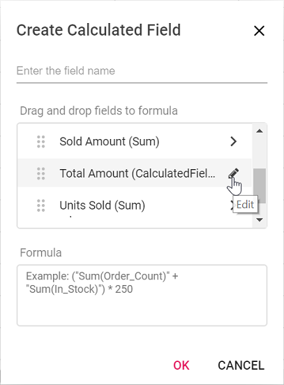
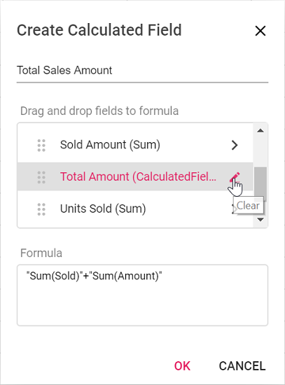
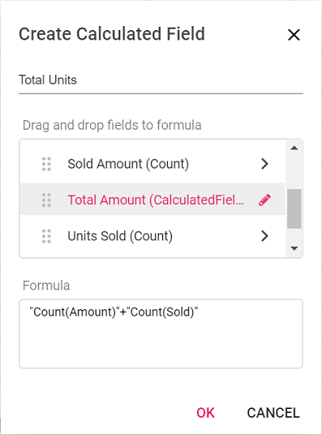
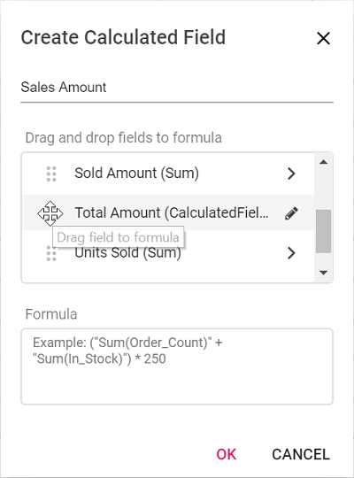
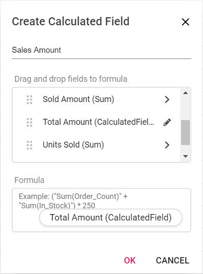
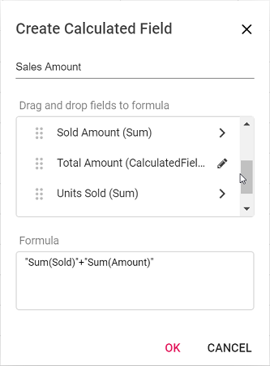

# Calculated field in ##Platform_Name## Pivotview control

Allows end user to create a new calculated field in the pivot table, based on available fields from the bound data source or using simple formula with basic arithmetic operators. It can be added at runtime through the built-in dialog, invoked from Field List UI. To do so, set the [`allowCalculatedField`](https://ej2.syncfusion.com/javascript/documentation/api/pivotview/pivotViewModel/#allowcalculatedfield) property to **true** in the pivot table. End user can now see a "CALCULATED FIELD" button enabled in Field List UI automatically, which on clicking will invoke the calculated field dialog and perform necessary operation.

Calculated field can also be included in the pivot table through code behind using the [`calculatedFieldsSettings`](https://ej2.syncfusion.com/javascript/documentation/api/pivotview/calculatedFieldSettings/). The required properties to create a new calculate field are:
* [`name`](https://ej2.syncfusion.com/javascript/documentation/api/pivotview/calculatedFieldSettings/#name): It allows to indicate the calculated field with a unique name.
* [`formula`](https://ej2.syncfusion.com/javascript/documentation/api/pivotview/calculatedFieldSettings/#formula): It allows to set the formula.

To use calculated field option, you need to inject the `CalculatedField` module in pivot table.

> The calculated field is applicable only for value fields.



 







        
















Meanwhile, user can also view calculated field dialog in UI by invoking [`createCalculatedFieldDialog`](https://ej2.syncfusion.com/javascript/documentation/api/pivotview/#createcalculatedfielddialog) method on an external button click which is shown in the below code sample.



 







        
















## Renaming the existing calculated field

Existing calculated field can be renamed only through the UI at runtime. To do so, open the calculated field dialog, select the target field and click "Edit" icon. User can now see the existing name getting displayed in the text box at the top of the dialog. Now, change the name based on user requirement and click "OK".

<!-- markdownlint-disable MD012 -->

<br/>
<br/>


## Editing the existing calculated field formula

Existing calculated field formula can be edited only through the UI at runtime. To do so, open the calculated field dialog, select the target field and click "Edit" icon. User can now see the existing formula getting displayed in a multiline text box at the bottom of the dialog. Now, change the formula based on user requirement and click "OK".


<br/>
<br/>


## Reusing the existing formula in a new calculate field

While creating a new calculated field, if user wants to the add the formula of an existing calculated field, it can be done easily. To do so, simply drag-and-drop the existing calculated field to the "Formula" section.


<br/>
<br/>

<br/>
<br/>


## Supported operators and functions for the calculated field formula

Below is a list of operators and functions that can be used in the formula to create the calculated fields.

* `+` – addition operator.

```ts
 Syntax: X + Y
```

* `-` – subtraction operator.

```ts
Syntax: X - Y
```

* `*` – multiplication operator.

```ts
Syntax: X * Y
```

* `/` – division operator.

```ts
Syntax: X / Y
```

* `^` – power operator.

```ts
Syntax: X^2
```

* `<` - less than operator.

```ts
Syntax: X < Y
```

* `<=` – less than or equal operator.

```ts
Syntax: X <= Y
```

* `>` – greater than operator.

```ts
Syntax: X > Y
```

* `>=` – greater than or equal operator.

```ts
Syntax: X >= Y
```

* `==` – equal operator.

```ts
Syntax: X == Y
```

* `!=` – not equal operator.

```ts
Syntax: X != Y
```

* `|` – OR operator.

```ts
Syntax: X | Y
```

* `&` – AND operator.

```ts
Syntax: X & Y
```

* `?` – conditional operator.

```ts
Syntax: condition ? then : else
```

* `isNaN` – function that checks if the value is not a number.

```ts
Syntax: isNaN(value)
```

* `!isNaN` – function that checks if the value is a number.

```ts
Syntax: isNaN(value)
```

* `abs` – function that returns the absolute value of a number.

```ts
Syntax: abs(number)
```

* `min` – function that returns the minimum value.

```ts
Syntax: min(number1, number2)
```

* `max` – function that returns the maximum value.

```ts
Syntax: max(number1, number2)
```

 > Also, you can use JavaScript [Math](https://developer.mozilla.org/en-US/docs/Web/JavaScript/Reference/Global_Objects/Math) object properties and methods directly to the formula.



 







        














